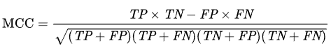

<div align='center'>
    
</div>

<div align='center'>

  [](mailto:ys3853428@gmail.com)
  [](https://github.com/yashksaini-coder)
  [](https://medium.com/@yashksaini)
  [](https://www.linkedin.com/in/yashksaini/)
  [](https://leetcode.com/u/yashksaini/)
  [](https://www.kaggle.com/yashsaini007)

</div> 

# 🛠️ Binary Prediction of Poisonous Mushrooms - Kaggle Playground Series (Season 4, Episode 8) 🔮

## **Objective** 🎯

The objective of this project is to develop binary classification models that can accurately predict whether a mushroom is edible or poisonous based on its physical characteristics. By analyzing various features and utilizing machine learning techniques, we aim to provide valuable insights into the field of mushroom classification and enhance the accuracy of our models.
<!-- 
## ⚙️ Built With

- [Python](https://www.python.org/)
- [Pandas](https://pandas.pydata.org/)
- [NumPy](https://numpy.org/)
- [Matplotlib](https://matplotlib.org/)
- [Seaborn](https://seaborn.pydata.org/)
- [Scikit-learn](https://scikit-learn.org/stable/)
- [XGBoost](https://xgboost.readthedocs.io/en/latest/)
- [LightGBM](https://lightgbm.readthedocs.io/en/latest/) -->

## Dataset 📦

The dataset provided for this competition includes various features related to customer demographics, vehicle information, and previous insurance history. Participants will use this data to build and train binary classification models, aiming to accurately predict the likelihood of a customer responding positively to the insurance offer.

**Explore the [dataset](https://www.kaggle.com/competitions/playground-series-s4e7/data), develop your machine learning models, and submit your predictions through the Kaggle [competition](https://www.kaggle.com/competitions/playground-series-s4e7/overview) platform before the deadline.**

## Files 📄

- **train.csv**: Training dataset containing abalone measurements and their corresponding ages.
- **test.csv**: Test dataset for which you need to predict whether a mushroom is edible or poisonous based on its physical characteristics.
- **sample_submission.csv**: A sample submission file demonstrating the correct format for predictions.

## **Evaluation** 📊

Submissions will be evaluated based on the Matthews correlation coefficient [MCC](https://en.wikipedia.org/wiki/Phi_coefficient) metric. This metric measures the ability of the model to distinguish between positive and negative responses, with higher scores indicating better performance.

<div align='center' >
    
</div>


## Installation & Usage 💻

Follow these simple steps to get started:

1. **Clone the Repository**: 
    ```bash
    git clone https://github.com/yashksaini-coder/Binary-Prediction-of-Poisonous-Mushrooms
    ```

2. **Navigate to the Repository Directory**:
    ```bash
    cd Binary-Prediction-of-Poisonous-Mushrooms
    ```

3. **Install Dependencies**:
    ```bash
    pip install -r requirements.txt
    ```
---

## 🌟Contributing Guide

You are welcome to contribute to this project! To ensure a smooth workflow, please follow these steps:

### 1. Fork the Project

- Go to the project repository on GitHub.
- Click on the [Fork]("https://github.com/yashksaini-coder/Binary-Prediction-of-Poisonous-Mushrooms/fork") button in the upper right corner of the page.
- This will create a copy of the repository in your GitHub account.

### 2. Create Your Feature Branch

- Clone the forked repository to your local machine:
  ```bash
  git clone https://github.com/your-username/Binary-Prediction-of-Poisonous-Mushrooms.git 
  ```
- Navigate to the project directory:
  ```bash
  cd Binary-Classification-of-Insurance-Cross-Selling
  ```
- Create a new branch for your feature:
  ```bash
  git checkout -b feature/AmazingFeature
  ```

### 3. Commit Your Changes

- Make your changes to the code.
- Stage your changes:
  ```bash
  git add .
  ```
- Commit your changes with a descriptive message:
  ```bash
  git commit -m 'Add some AmazingFeature'
  ```

### 4. Push to the Branch

- Push your changes to your forked repository:
  ```bash
  git push origin feature/AmazingFeature
  ```

### 5. Open a Pull Request

- Go to the original repository on GitHub.
- Click on the "Compare & pull request" button.
- Ensure the base repository is the original repository and the base branch is the branch you want to merge into (e.g., `main` or `master`).
- Provide a descriptive title and detailed description of your changes.
- Click on the "Create pull request" button.

---

Thank you for your contributions! Your efforts help make this project better for everyone. If you have any questions or need assistance, feel free to open an issue or contact the maintainers.

---

## 📝 Conclusion

In conclusion, this project aimed to predict which customers respond positively to an automobile insurance offer. By utilizing various machine learning models and analyzing customer demographics, vehicle information, and previous insurance history, we were able to develop binary classification models. These models can help insurance companies efficiently target potential customers and improve their marketing strategies and customer engagement.

Moving forward, there are several tasks that still need to be completed for this project:

- [ ] Use LightGBM model
- [ ] Use XGB model
- [ ] Use CatBoost model
- [ ] Add the project conclusion

By completing these tasks, we can further enhance the accuracy and performance of our models. Overall, this project provides valuable insights into the field of insurance cross-selling and demonstrates the power of machine learning in improving business strategies.

Thank you for following along with this project. If you have any questions or suggestions, please feel free to reach out.

---

### License
Distributed under the MIT License. See [LICENSE](LICENSE) for more information.
